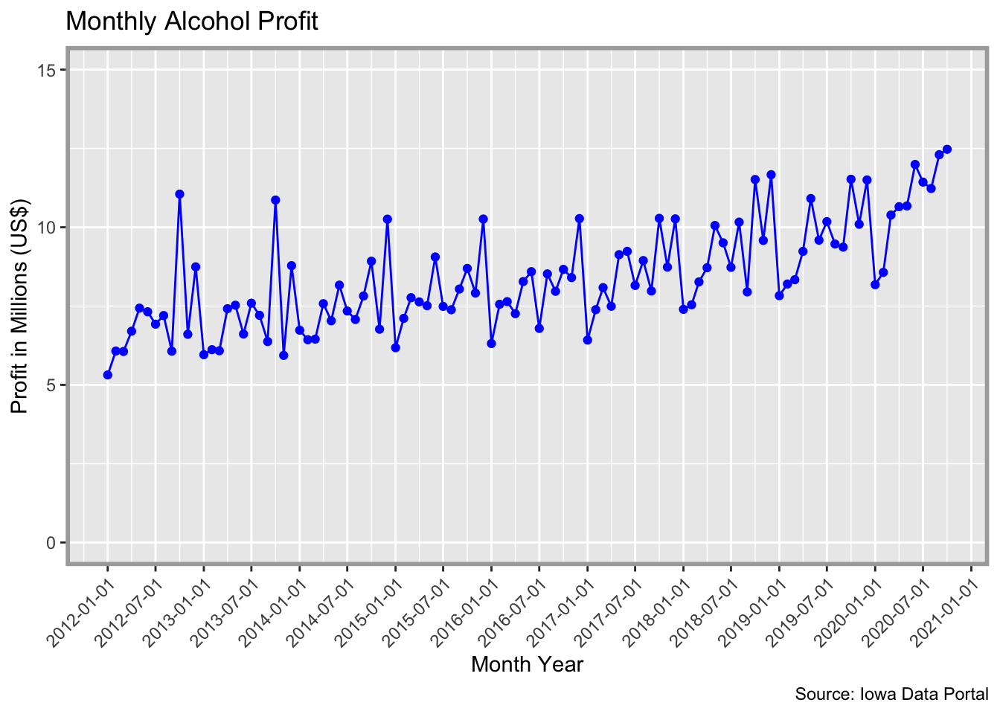

<!-- README.md is generated from README.Rmd. Please edit that file -->

# ialiquor

<!-- badges: start -->

[](https://www.tidyverse.org/lifecycle/#experimental)
[](https://opensource.org/licenses/MIT)
[](https://github.com/nikdata/ialiquor/commit/master)
<!-- badges: end -->

The **{ialiquor}** package provides a summary of the monthly liquor
sales by county and by liquor type in the State of Iowa. This dataset
comes from the Iowa Data Portal and is limited to beverages classified
as [Class E](https://abd.iowa.gov/license-classifications). Class E
beverages (as according to Iowa) are:

> For grocery, liquor and convenience stores, etc. Allows for the sale
> of alcoholic liquor for off-premises consumption in original unopened
> containers. No sales by the drink. Sunday sales are included. Also
> allows wholesale sales to on-premises Class A, B, C and D liquor
> licensees but must have a TTB Federal Wholesale Basic Permit.

In other words, this dataset is limited to retailers that are
essentially selling “hard” liquor. This does not include data for beer
sales (which is a Class C license) or wine (which is a Class B license).

**WIP**

## Installation

This package is not available on CRAN, but can be installed from GitHub:

``` r
# install.packages("devtools")
devtools::install_github("nikdata/ialiquor", ref = "main")
```

## Usage

The {ialiquor} package provides a monthly summary of the alcohol (class
E) sales in the State of Iowa. There are two different datasets
contained that provide total revenue, total cost to state, total bottles
sold, and total volume sold (in liters) by either category (e.g.,
imported vodka, spearmint schnapps, etc.) or county name.

### Preview of County Sales

``` r
library(ialiquor)
library(dplyr)
#> 
#> Attaching package: 'dplyr'
#> The following objects are masked from 'package:stats':
#> 
#>     filter, lag
#> The following objects are masked from 'package:base':
#> 
#>     intersect, setdiff, setequal, union
data('county_sales')

dplyr::glimpse(county_sales)
#> Rows: 11,869
#> Columns: 7
#> $ year_mon       <dttm> 2012-01-01, 2012-01-01, 2012-01-01, 2012-01-01, 2012-…
#> $ county         <chr> "Adair", "Adams", "Allamakee", "Appanoose", "Audubon",…
#> $ county_number  <chr> "01", "02", "03", "04", "05", "06", "07", "08", "09", …
#> $ state_cost     <dbl> 16606.07, 5856.93, 31804.52, 25961.56, 8965.06, 27215.…
#> $ bottles_sold   <dbl> 2263, 686, 3933, 3571, 1188, 3403, 89084, 7283, 10725,…
#> $ retail_revenue <dbl> 24967.11, 8803.29, 47799.05, 38976.62, 13472.98, 40914…
#> $ liters_sold    <dbl> 2165.94, 701.04, 4177.72, 3395.90, 1245.01, 3474.91, 6…
```

### Preview of Category Sales

``` r
library(ialiquor)
library(dplyr)

data('category_sales')

dplyr::glimpse(category_sales)
#> Rows: 6,492
#> Columns: 7
#> $ year_mon       <dttm> 2012-01-01, 2012-01-01, 2012-01-01, 2012-01-01, 2012-…
#> $ type           <chr> "vodka", "other", "liqueur", "cocktail", "gin", "brand…
#> $ category       <chr> "100 proof vodka", "american alcohol", "american amare…
#> $ state_cost     <dbl> 69602.62, 30443.92, 36267.20, 247123.89, 164411.67, 15…
#> $ retail_revenue <dbl> 104432.75, 45665.88, 54408.14, 375718.34, 246903.72, 2…
#> $ bottles_sold   <dbl> 12326, 3796, 8749, 35344, 37016, 39683, 646, 68, 5773,…
#> $ liters_sold    <dbl> 14100.75, 2847.00, 8006.00, 50682.25, 28496.46, 20741.…
```

### Potential Use Cases

#### Monthly Profit by Year Month

``` r
library(dplyr)
library(ggplot2)
library(ialiquor)

data("county_sales")

county_sales %>%
  dplyr::group_by(year_mon) %>%
  dplyr::summarize(
    total_cost = sum(state_cost),
    total_revenue = sum(retail_revenue),
    state_profit = (total_revenue-total_cost)/1000000,
    .groups = 'drop'
  ) %>%
  ggplot2::ggplot(ggplot2::aes(x = year_mon, y = state_profit)) +
  ggplot2::geom_line(color = 'blue') +
  ggplot2::geom_point(ggplot2::aes(y = state_profit), color = 'blue') +
  ggplot2::labs(x = 'Month Year', y = "Profit in Millions (US$)", title = 'Monthly Alcohol Profit', caption = 'Source: Iowa Data Portal') +
  ggplot2::ylim(0,15) +
  ggplot2::scale_x_datetime(date_breaks = '6 months') +
  ggplot2::theme(axis.text.x = ggplot2::element_text(angle = 45, hjust = 1), 
                 panel.border = ggplot2::element_rect(color = 'darkgray', fill = NA, size = 2))
```



### Top 10 Alcohol Categories by Liters Sold

``` r

library(dplyr)
library(ialiquor)

data("category_sales")

category_sales %>%
  dplyr::group_by(type) %>%
  dplyr::summarize(
    total_liters_sold = sum(liters_sold),
    .groups = 'keep'
  ) %>%
  dplyr::arrange(desc(total_liters_sold)) %>%
  dplyr::top_n(10)
#> Selecting by total_liters_sold
#> # A tibble: 12 x 2
#> # Groups:   type [12]
#>    type     total_liters_sold
#>    <chr>                <dbl>
#>  1 whiskey         55877755. 
#>  2 vodka           55411656. 
#>  3 rum             23394506. 
#>  4 liqueur          8626919. 
#>  5 tequila          7060417. 
#>  6 schnapps         6982939. 
#>  7 cocktail         6721458. 
#>  8 other            5579965. 
#>  9 brandy           5531661. 
#> 10 gin              4989163. 
#> 11 unknown           187463. 
#> 12 beer                  40.5
```
